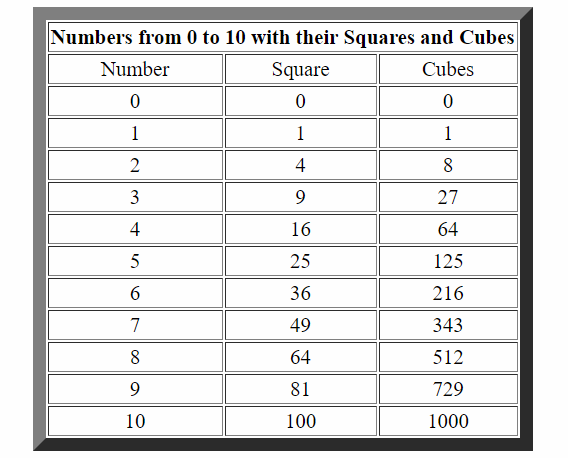

# VTU-Web-Lab-Program-2
### JavaScript that calculates the squares and cubes of the numbers from 0 to 10 and outputs HTML text that displays the resulting values in an HTML table format.
## SCREENSHOT

